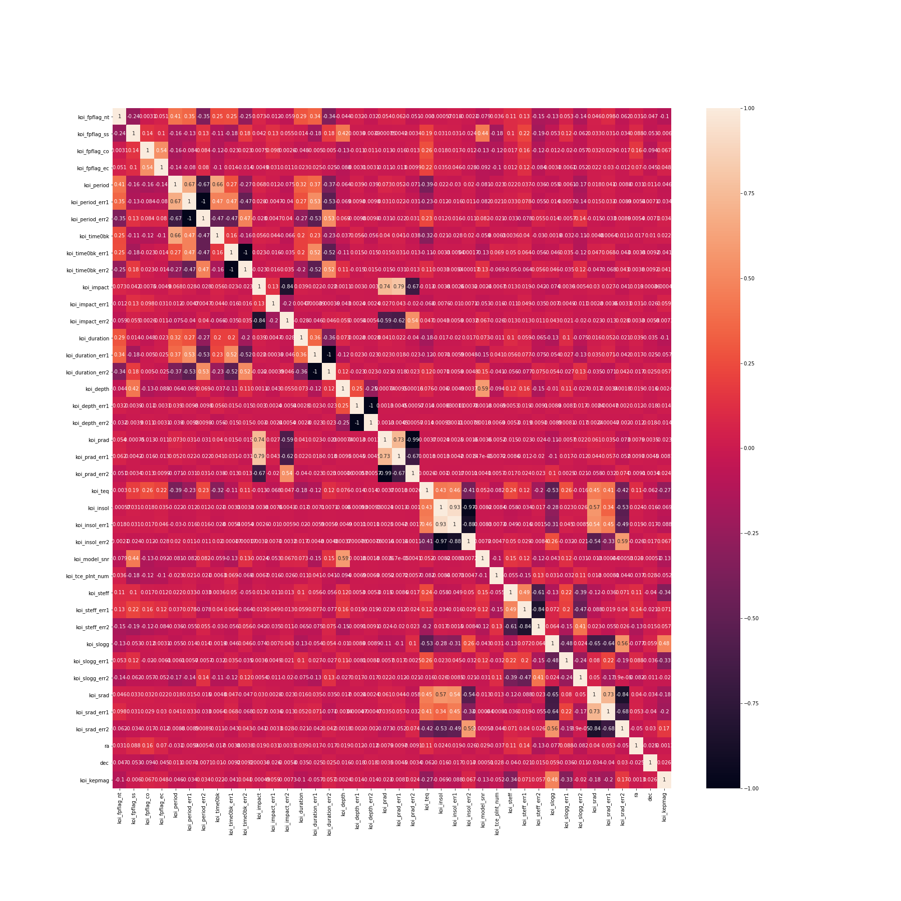
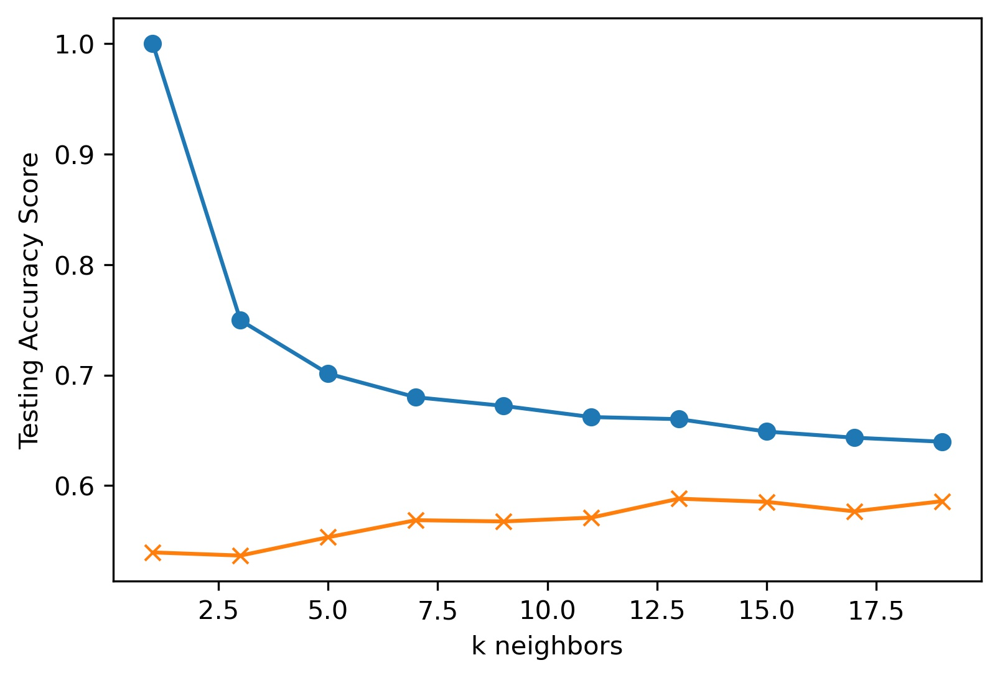

# Machine Learning Report - Exoplanet Exploration

* Create a README that reports a comparison of each model's performance as well as a summary about your findings and any assumptions you can make based on your model (is your model good enough to predict new exoplanets? Why or why not? What would make your model be better at predicting new exoplanets?).

### Background

Created machine learning models capable of classifying candidate exoplanets from the raw dataset provided from the NASA Kepler space telescope that has been out on a planet-hunting mission to discover hidden planets outside of our solar system.

Ths assignment demonstrates:

1. Preprocessing the raw data
2. Tuning the models
3. Comparing multiple models

- - -

### Features Selected
To help to determine which features to keep in the dataset, a correlation matrix was created (located in the Random Forest notebook). 

* A large positive value (near to 1.0) indicates a strong positive correlation.

* A large negative value (near to -1.0) indicates a strong negative correlation.

* A value near to 0 (both positive or negative) indicates the absence of any correlation between the two variables.

Since the correlation matrix has many values near 0, it was decided not to eliminate any of the featrues from the dataset

### Random Forest Model
Add text.

``Training Data Score: 1.0``

``Testing Data Score: 0.902745995423341``

``{'n_estimators': 150}``

``0.8897545099294858``

### K Nearest Neighbors (KNN) Model
When increasing the neighbors to something over 20, the model does not change much, stays around 82% accuracy for the prediction.

``k=13 Test Acc: 0.820``

 In hypertuning the model, observing k13 at 82%, set up the hyperparametric tuning to go from 3 to 23. The accuracy still hovers around 82%

 ``{'n_neighbors': 21}``

``0.8222367358225574``

### Support Vector Machine (SVM) Model
Add text.
- - -

