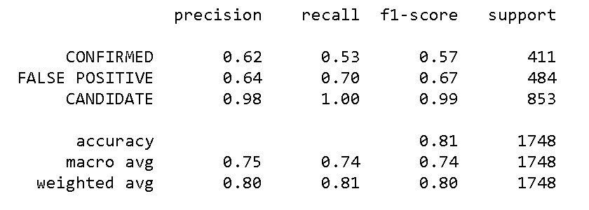

# Machine Learning Report - Exoplanet Exploration

## Project Overview
Created machine learning models capable of classifying candidate exoplanets from the raw dataset provided from the NASA Kepler space telescope ([Exoplanet Data Source](https://www.kaggle.com/nasa/kepler-exoplanet-search-results)).

Ths project demonstrates:

1. Preprocessing of raw data
2. Tuning the models
3. Comparing multiple models

Languages and libraries used:

* Pandas
* Scikit-learn
* Seaborn
* Matplotlib

- - -

## Models Methodology
All models were created using SKlearn. From the dataset, `koi_disposition` was the feature in which to predict `CONFIRMED`, `FALSE POSITIVE`, or `CANDIDATE`. Three classification models were used.

* Model 1 - Classification Tree and Random Forest
* Model 2 - K Nearest Neighbors (KNN)
* Model 3 - Support Vector Machine (SVM)

These three models can be found in the  [saved_files folder](https://github.com/klharp/machine-learning-challenge/tree/main/saved_files) on GitHub.

### Features Selected
To help to determine which features to keep in the dataset, a correlation matrix was created.  The [features notebook](https://github.com/klharp/machine-learning-challenge) contains the matrix and the list for the final features. The correlation matrix of all the features displays:

* A large positive value (near to 1.0) indicates a strong positive correlation.

* A large negative value (near to -1.0) indicates a strong negative correlation.

* A value near to 0 (both positive or negative) indicates the absence of any correlation between the two variables.

The correlation matrix has many values near 0. It was determined to eliminate the err data with the large negative numbers. All of the features eliminated were err features. This modified features list was used in all models.

Using the reduced features, the data in each model was scaled (using the MinMaxScaler) to train-test samples. Each model was then tuned using the GridSearchCV methodology.

- - -

## Random Forest Model
Using a Decision Tree classifier, the testing accuracy is about 84%

``Training Data Score: 1.0`` 
``Testing Data Score: 0.8392448512585813``

Using a Random Forest classifier with the n-estimators set to 200, The testing accuracy is just over 90%.

``Training Data Score: 1.0`` 
``Testing Data Score: 0.9056064073226545``

 In tuning the model with the parametric grid set to 100, 200 and 300, the accuracy is just over 89%.

``{'n_estimators': 100}`` 
``0.8937595965623386``

## KNN Model
Using a K Nearest Neighbors classifier, when increasing the neighbors to something over 15, the model does not change much.

``k: 29,  Training Data Score: 0.832`` 
``k: 29,  Testing Data Score: 0.810``

Setting the k to 15 where the lines start to flatten out, The accuracy is just over 82%.

``k=15 Test Acc: 0.821``

 In tuning the model and observing k15 at 82%, set up the parametric grid to go from 3 to 21. The accuracy is just over 81%

 ``{'n_neighbors': 21}`` 
``0.8138441554661291``

## SVM Model
With the Support Vector Machine classifier, the accuracy was just over 80%, with the Candidate having the highest precision. The precision for ``CONFIRMED`` and ``FALSE POSITIVE`` is considerably lower then for the CANDIDATE.

``Test Acc: 0.806``

 In tuning the model, observing 80% accuracy, set up the parametric grid to 1, 5, 10, 20, 40. The accuracy increased to 83%.

 ``{'C': 40, 'gamma': 0.0001}`` 
``0.8321507579010181``

- - -

## Summary
Removing the err features generally dropped the accuracy 3-5 percentage points.Further study should be done regarding these err features to determine their importance and whether or not they should be left in the dataset. 

Another issue for further study would be the necessity for removing the ``CANDIDATE`` from the training set. According to the KNN model, it's precision is much higher than the others. This delta warrants further study in pre-processing the raw dataset.

The Random Forest classifier presented the highest accuracy percentage (89-90%). The KNN classifier and the Support Vector Machine classifer had  lower accuracy percentage (81-83%). The The accuracy levels of 89-90% is fairly good at making the KOI Disposition prediction. 

The saved Random Forest model can be found [here](https://github.com/klharp/machine-learning-challenge/tree/main/saved_files), along with the files for the other models.