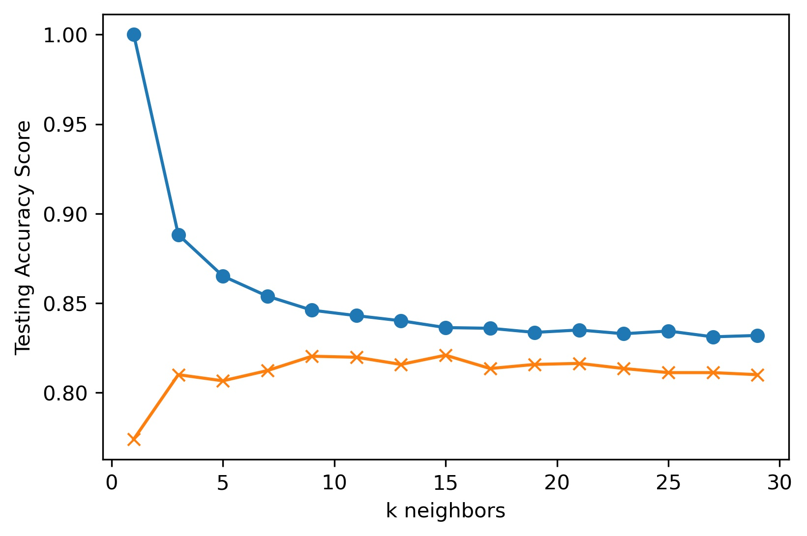

# Machine Learning Report - Exoplanet Exploration

### Background

Created machine learning models capable of classifying candidate exoplanets from the raw dataset provided from the NASA Kepler space telescope ([Exoplanet Data Source](https://www.kaggle.com/nasa/kepler-exoplanet-search-results)).

Ths assignment demonstrates:

1. Preprocessing of raw data
2. Tuning the models
3. Comparing multiple models

- - -

### Features Selected
To help to determine which features to keep in the dataset, a correlation matrix was created (located in the [Random Forest notebook](model_1.ipynb)). 

* A large positive value (near to 1.0) indicates a strong positive correlation.

* A large negative value (near to -1.0) indicates a strong negative correlation.

* A value near to 0 (both positive or negative) indicates the absence of any correlation between the two variables.

Since the correlation matrix has many values near 0, it was decided not to eliminate any of the features from the dataset.

- - -

### Random Forest Model
Using a Decision Tree classifier, the testing accuracy is about 85%

``Training Data Score: 1.0``

``Testing Data Score: 0.8478260869565217``

Using a Random Forest classifier with the n-estimators set to 200, The testing accuracy is about 90%

``Training Data Score: 1.0``

``Testing Data Score: 0.8975972540045767``

 In tuning the model,  with the parametric grid set to 100, 200 and 300, The accuracy is around 89%

``{'n_estimators': 300}``

``0.8922348801839629``

### K Nearest Neighbors (KNN) Model
Using a K Nearest Neighbors classifier, when increasing the neighbors to something over 20, the model does not change much, stays around 82% accuracy.

``k=13 Test Acc: 0.820``

 In tuning the model and observing k13 at 82%, set up the parametric grid to go from 3 to 23. The accuracy still hovers around 82%

 ``{'n_neighbors': 21}``

``0.8222367358225574``

### Support Vector Machine (SVM) Model
With the Support Vector Machine classifier, the accuracy was 84%, with the Candidate having the highest precision.

``Test Acc: 0.842``

 In tuning the model, observing 84% accuracy, set up the parametric gride to go from 1 to 40. The accuracy increases to 88%.

 ``{'C': 40, 'gamma': 0.0001}``

``0.8813619295730575``

- - -

### Summary
The Random Forest classifier, with tuning presented the highest accuracy percentage. The Support Vector Machine classifer with tuning had a slightly lower accuracy percentage. The accuracy levels of 88-89% is fairly good at making the KOI Disposition prediction. 